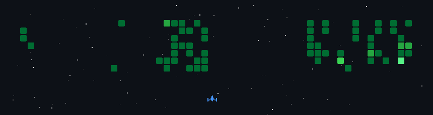

<!--START_SECTION:waka-->


**I'm an Early 🐤** 

```text
🌞 Morning                341 commits         ⬛⬛⬛⬛⬜⬜⬜⬜⬜⬜⬜⬜⬜⬜⬜⬜⬜⬜⬜⬜⬜⬜⬜⬜⬜   14.02 % 
🌆 Daytime                1049 commits        ⬛⬛⬛⬛⬛⬛⬛⬛⬛⬛⬛⬜⬜⬜⬜⬜⬜⬜⬜⬜⬜⬜⬜⬜⬜   43.13 % 
🌃 Evening                740 commits         ⬛⬛⬛⬛⬛⬛⬛⬛⬜⬜⬜⬜⬜⬜⬜⬜⬜⬜⬜⬜⬜⬜⬜⬜⬜   30.43 % 
🌙 Night                  302 commits         ⬛⬛⬛⬜⬜⬜⬜⬜⬜⬜⬜⬜⬜⬜⬜⬜⬜⬜⬜⬜⬜⬜⬜⬜⬜   12.42 % 
```


📊 **This Week I Spent My Time On** 

```text
🕑︎ Time Zone: Asia/Jakarta

💬 Programming Languages: 
Bash                     9 mins              ⬛⬛⬛⬛⬛⬛⬛⬛⬛⬛⬛⬛⬛⬜⬜⬜⬜⬜⬜⬜⬜⬜⬜⬜⬜   50.66 % 
shell script             6 mins              ⬛⬛⬛⬛⬛⬛⬛⬛⬜⬜⬜⬜⬜⬜⬜⬜⬜⬜⬜⬜⬜⬜⬜⬜⬜   33.57 % 
Markdown                 2 mins              ⬛⬛⬛⬛⬜⬜⬜⬜⬜⬜⬜⬜⬜⬜⬜⬜⬜⬜⬜⬜⬜⬜⬜⬜⬜   14.19 % 
TypeScript               0 secs              ⬜⬜⬜⬜⬜⬜⬜⬜⬜⬜⬜⬜⬜⬜⬜⬜⬜⬜⬜⬜⬜⬜⬜⬜⬜   01.59 % 
```

🤖 **AI Coding This Week** 

```text
No AI Coding Activity Tracked This Week
```


 Last Updated on 02/09/2026 02:34:37 UTC
<!--END_SECTION:waka-->
</details>
